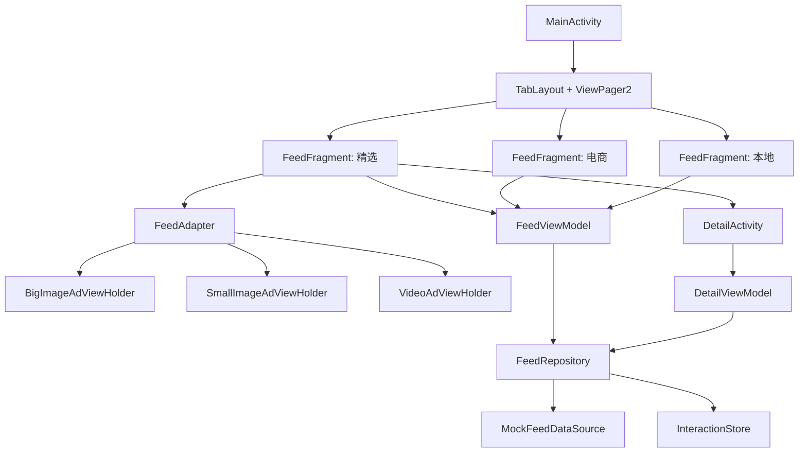

# AI 广告信息流工程框架新手说明

这份文档是给刚开始学 Android 的同学看的。它不假设你已经懂 MVVM、RecyclerView、ViewModel、StateFlow、Adapter 这些概念，会从“这个 App 是怎么跑起来的”开始，一层一层解释当前工程为什么这样拆、每个文件做什么、数据怎么流动、以后你们两个人应该怎么分工继续开发。

建议阅读顺序：

1. 先看第 1 到第 4 节，建立整体地图。
2. 再对照 Android Studio 的 Project 面板看第 5 节文件说明。
3. 跑一遍 App 后看第 6 节工作流程。
4. 开始改代码前看第 8、9、10 节。

---

## 1. 这个工程现在实现了什么

当前工程是“AI 广告推荐信息流”的 Android 端 MVP，也就是最小可运行版本。

它现在已经有：

- 一个首页。
- 三个频道 Tab：精选、电商、本地。
- 每个频道一个单列广告信息流。
- 三种广告卡片：大图、小图、视频封面。
- 下拉刷新。
- 上拉加载更多。
- 点击卡片进入详情页。
- 点赞、收藏、分享、点击次数的本地状态。
- 列表页和详情页之间的互动状态同步。
- mock AI 摘要和标签。

它现在还没有：

- 真实后端接口。
- 真实图片加载。
- 真实视频播放。
- 真实 AI 搜索。
- 曝光统计。
- 本地数据库持久化。

换句话说，现在这个工程的作用是：先把 Android 客户端的“骨架”和“数据流”搭稳，让你们能在一个能运行的 App 上继续分工。

---

## 2. 为什么先做这个 MVP

你们两个都是 Android 新手，如果一开始同时做下面这些事情，会非常容易卡住：

- RecyclerView 列表。
- 多样式卡片。
- ViewModel。
- 状态同步。
- 网络请求。
- 图片加载。
- 视频播放器。
- AI 接口。
- 统计埋点。

这些知识点每一个都够学一阵子。为了降低难度，当前工程采用了 **Mock-first** 思路：

> 先不用真实网络，先用本地 mock 数据模拟后端返回。  
> 等列表、详情页、状态同步都跑通后，再把 mock 数据源替换成 Retrofit 网络数据源。

这样做的好处：

- App 现在就能运行，不依赖后端。
- UI 同学可以先做页面。
- 数据同学可以先做模型、Repository、状态管理。
- 后续接后端时，不用推翻 UI。
- 答辩时可以清楚解释“客户端如何从 mock 平滑切到网络”。

---

## 3. 技术选型为什么这样选

### 3.1 Kotlin

Android 官方推荐 Kotlin。相比 Java，它写起来更短，空值处理更安全，也更适合协程和 StateFlow。

在本工程里，Kotlin 主要体现在：

- `data class` 定义数据模型。
- `when` 表达式区分频道和卡片类型。
- `StateFlow` 做状态流转。
- lambda 传点击回调。

例子：

```kotlin
data class InteractionState(
    val liked: Boolean = false,
    val collected: Boolean = false,
    val shareCount: Int = 0,
    val clickCount: Int = 0
)
```

这表示一条广告的互动状态。

### 3.2 View 体系 + XML + ViewBinding

Android 做 UI 有两条常见路线：

- View + XML。
- Jetpack Compose。

本课题文档明确强调了 cell 复用、播放器复用、缓存池，这些都是传统 View 体系里很经典的概念。所以我们选择：

- XML 写布局。
- Activity / Fragment 控制界面。
- ViewBinding 连接 Kotlin 和 XML。

为什么不用 Compose：

- Compose 对新手也有学习成本。
- RecyclerView 的 cell 复用逻辑在传统 View 里更容易解释给评委。
- 课题里提到的多样式 cell、播放器 attach/detach、缓存池，都更贴近 RecyclerView + ViewHolder。

ViewBinding 是什么：

> Android 根据 XML 自动生成一个 Binding 类，让你不用再写 `findViewById`。

例如：

```kotlin
binding.titleText.text = card.ad.title
```

这里的 `titleText` 来自 XML 里的：

```xml
android:id="@+id/title_text"
```

XML id 会自动转换成 Kotlin 里的驼峰命名。

### 3.3 MVVM

MVVM 是一种分层方式：

- Model：数据模型和数据来源。
- View：页面，负责显示。
- ViewModel：页面状态和业务动作。

本工程里可以这样理解：

```text
View 层
MainActivity / FeedFragment / DetailActivity / Adapter / ViewHolder / XML

ViewModel 层
FeedViewModel / DetailViewModel

Repository 层
FeedRepository

Data 层
MockFeedDataSource / InteractionStore / data model
```

为什么用 MVVM：

- 页面代码不会直接到处找数据。
- 数据逻辑不会写进 Activity。
- UI 和数据可以分工开发。
- 后续把 mock 换成网络时，UI 基本不用改。
- 更容易写测试。

一句话：

> View 只管展示，ViewModel 只管页面状态，Repository 只管数据，DataSource 只管数据从哪里来。

### 3.4 RecyclerView + ListAdapter + DiffUtil

广告信息流本质上是一个很长的列表，所以用 RecyclerView。

RecyclerView 的核心价值：

- 屏幕上只显示少量卡片。
- 滑走的卡片会被复用。
- 不会为几百条数据创建几百个完整 View。

ListAdapter 是 RecyclerView Adapter 的加强版，它配合 DiffUtil 使用。

DiffUtil 的作用：

> 比较新旧列表，只刷新真正变化的那几项。

例如你只点了一条广告的点赞，理论上不需要刷新整个列表，只需要刷新这一条。

### 3.5 TabLayout + ViewPager2

顶部频道切换用了：

- `TabLayout`：显示“精选 / 电商 / 本地”三个标签。
- `ViewPager2`：承载每个频道对应的页面。

这样每个频道都可以是一个独立的 `FeedFragment`。

好处：

- 频道之间代码复用。
- 每个频道可以各自加载数据。
- 后续做“每个频道保存滚动位置”更自然。

### 3.6 StateFlow

StateFlow 是 Kotlin 协程里的“状态流”。

你可以把它想象成：

> 一个会自动通知订阅者的变量。

例如 `FeedViewModel` 里有：

```kotlin
val uiState: StateFlow<FeedUiState>
```

`FeedFragment` 订阅它：

```kotlin
viewModel.uiState.collect(::render)
```

当 ViewModel 更新 `uiState` 时，Fragment 的 `render()` 就会被调用，界面自动刷新。

### 3.7 Repository

Repository 是数据仓库。

它不一定是真的数据库，它的职责是：

- 对 ViewModel 提供统一的数据入口。
- 屏蔽数据到底来自 mock、网络还是本地数据库。
- 合并“广告内容数据”和“用户互动状态”。

当前工程里：

```kotlin
FeedRepository(
    dataSource = MockFeedDataSource(),
    interactionStore = InteractionStore()
)
```

以后可以换成：

```kotlin
FeedRepository(
    dataSource = RetrofitFeedDataSource(),
    interactionStore = InteractionStore()
)
```

只要接口不变，UI 层不用知道数据源已经换了。

---

## 4. 整体架构图

当前系统可以画成这样：



更简单地说：

```text
用户看到页面
  ↓
Activity / Fragment
  ↓
ViewModel
  ↓
Repository
  ↓
Mock 数据源 + 互动状态仓库
```

---

## 5. 文件夹和文件分别做什么

下面按 Android Studio 里的目录解释。

### 5.1 根入口

#### `MainActivity.kt`

路径：

```text
app/src/main/java/com/example/ai_ad_feed_flow/MainActivity.kt
```

职责：

- App 启动后的主页面。
- 加载 `activity_main.xml`。
- 设置顶部 Toolbar。
- 设置 `ViewPager2`。
- 用 `TabLayoutMediator` 把 Tab 和 ViewPager2 绑定起来。

核心代码：

```kotlin
binding.feedPager.adapter = FeedPagerAdapter(this)

TabLayoutMediator(binding.channelTabs, binding.feedPager) { tab, position ->
    tab.text = FeedChannel.entries[position].title
}.attach()
```

这段代码做了两件事：

- `feedPager` 知道自己要显示哪些页面。
- 顶部 Tab 知道每一页对应哪个标题。

#### `AppGraph.kt`

路径：

```text
app/src/main/java/com/example/ai_ad_feed_flow/AppGraph.kt
```

职责：

- 放全局单例对象。
- 当前主要提供一个全局共享的 `FeedRepository`。

为什么需要它：

列表页和详情页必须共享同一份互动状态。如果每个页面都 new 一个 Repository，就会出现：

- 列表页点赞了。
- 详情页不知道。
- 详情页收藏了。
- 返回列表不同步。

所以这里让它们都使用：

```kotlin
AppGraph.feedRepository
```

这不是大型项目最完整的依赖注入方案，但对训练营 MVP 足够简单直观。

---

### 5.2 data/model：数据长什么样

路径：

```text
app/src/main/java/com/example/ai_ad_feed_flow/data/model/
```

这个目录只放数据结构，不做页面逻辑。

#### `FeedChannel.kt`

表示频道：

```kotlin
enum class FeedChannel(val title: String) {
    FEATURED("精选"),
    ECOMMERCE("电商"),
    LOCAL("本地")
}
```

`title` 是显示在 Tab 上的中文标题。

#### `AdType.kt`

表示广告卡片类型：

```kotlin
enum class AdType {
    BIG_IMAGE,
    SMALL_IMAGE,
    VIDEO
}
```

后面 Adapter 会根据这个类型选择不同布局。

#### `AdItem.kt`

表示一条广告的内容数据：

```kotlin
data class AdItem(
    val id: String,
    val channel: FeedChannel,
    val type: AdType,
    val title: String,
    val brand: String,
    val summary: String,
    val tags: List<String>,
    val coverUrl: String,
    val videoUrl: String?,
    val description: String
)
```

这里的字段可以分成几类：

- `id`：广告唯一标识。
- `channel`：属于哪个频道。
- `type`：用哪种卡片样式展示。
- `title` / `brand` / `description`：广告文案。
- `summary` / `tags`：模拟 AI 生成的摘要和标签。
- `coverUrl` / `videoUrl`：以后接真实图片和视频会用到。

#### `InteractionState.kt`

表示一条广告的互动状态：

```kotlin
data class InteractionState(
    val liked: Boolean = false,
    val collected: Boolean = false,
    val shareCount: Int = 0,
    val clickCount: Int = 0
)
```

注意：互动状态没有放进 `AdItem`。

为什么？

因为广告内容和用户行为是两类数据：

- 广告内容：后端给的，比较稳定。
- 用户行为：本地发生的，会变化。

分开以后，后续接后端更清楚。

#### `FeedCardUiModel.kt`

表示真正给 UI 渲染的卡片：

```kotlin
data class FeedCardUiModel(
    val ad: AdItem,
    val interaction: InteractionState
)
```

它是：

```text
广告内容 + 互动状态
```

UI 最终只认这个模型。

#### `PageResult.kt`

表示分页结果：

```kotlin
data class PageResult<T>(
    val items: List<T>,
    val page: Int,
    val hasMore: Boolean
)
```

`hasMore` 告诉 ViewModel 是否还有下一页。

---

### 5.3 data/source：数据从哪里来

路径：

```text
app/src/main/java/com/example/ai_ad_feed_flow/data/source/
```

#### `FeedDataSource.kt`

这是一个接口：

```kotlin
interface FeedDataSource {
    fun getPage(channel: FeedChannel, page: Int, pageSize: Int): PageResult<AdItem>

    fun getById(id: String): AdItem?
}
```

接口的意思是：

> 我不关心你是真网络还是假数据，只要你能按这个规则给我广告数据就行。

#### `MockFeedDataSource.kt`

这是当前真实使用的数据源。

它在本地生成假数据：

- 每个频道 12 条广告。
- 每页加载 6 条。
- 广告类型按大图、小图、视频循环。

它现在模拟的是后端接口：

```text
GET /feed?channel=featured&page=1&size=6
```

以后接网络时，可以新增：

```text
RetrofitFeedDataSource.kt
```

并实现同一个 `FeedDataSource` 接口。

---

### 5.4 data/store：互动状态放哪里

路径：

```text
app/src/main/java/com/example/ai_ad_feed_flow/data/store/InteractionStore.kt
```

`InteractionStore` 是本地互动状态仓库。

它保存的是：

```kotlin
Map<String, InteractionState>
```

可以理解成：

```text
广告 id -> 这条广告的点赞/收藏/分享/点击状态
```

例如：

```text
featured_ad_01 -> liked=true, collected=false, shareCount=0, clickCount=1
```

为什么用 `StateFlow`：

```kotlin
private val _states = MutableStateFlow<Map<String, InteractionState>>(emptyMap())
val states: StateFlow<Map<String, InteractionState>> = _states.asStateFlow()
```

因为列表页和详情页都需要知道互动状态变化。

当详情页点赞：

```kotlin
repository.toggleLike(adId)
```

底层会更新 `InteractionStore`，然后 `StateFlow` 通知列表页和详情页刷新。

---

### 5.5 data/repository：统一数据出口

路径：

```text
app/src/main/java/com/example/ai_ad_feed_flow/data/repository/FeedRepository.kt
```

Repository 的职责是：

- 找 `FeedDataSource` 拿广告内容。
- 找 `InteractionStore` 拿互动状态。
- 把两者合成 `FeedCardUiModel`。
- 给 ViewModel 一个简单接口。

关键函数：

```kotlin
fun loadPage(
    channel: FeedChannel,
    page: Int,
    pageSize: Int,
    refresh: Boolean = false
): PageResult<FeedCardUiModel>
```

它做的事情：

1. 从 dataSource 取一页 `AdItem`。
2. 根据是否刷新决定替换旧数据还是追加旧数据。
3. 把 `AdItem` 转成 `FeedCardUiModel`。
4. 返回给 ViewModel。

转换发生在这里：

```kotlin
private fun toCard(adItem: AdItem): FeedCardUiModel {
    return FeedCardUiModel(
        ad = adItem,
        interaction = interactionStore.currentState(adItem.id)
    )
}
```

这就是“内容数据 + 互动状态”的合并点。

---

### 5.6 feed：信息流页面

路径：

```text
app/src/main/java/com/example/ai_ad_feed_flow/feed/
```

#### `FeedUiState.kt`

这是列表页的完整状态：

```kotlin
data class FeedUiState(
    val items: List<FeedCardUiModel> = emptyList(),
    val isRefreshing: Boolean = false,
    val isLoadingMore: Boolean = false,
    val hasMore: Boolean = true,
    val errorMessage: String? = null
)
```

为什么不让 Fragment 自己维护这些变量？

因为 Fragment 是 View 层，它应该尽量只负责显示。状态应该由 ViewModel 管。

#### `FeedViewModel.kt`

这是信息流页面的“大脑”。

它负责：

- 首次加载。
- 下拉刷新。
- 上拉加载更多。
- 点赞。
- 收藏。
- 分享。
- 监听互动状态变化。

它对 UI 暴露：

```kotlin
val uiState: StateFlow<FeedUiState>
```

Fragment 只需要订阅这个状态。

`loadFirstPage()` 做首次加载：

```kotlin
fun loadFirstPage() {
    currentPage = FIRST_PAGE
    _uiState.update { it.copy(isRefreshing = true, errorMessage = null) }
    val result = repository.loadPage(...)
    _uiState.update { it.copy(items = result.items, isRefreshing = false) }
}
```

`loadNextPage()` 做加载更多：

```kotlin
fun loadNextPage() {
    val state = _uiState.value
    if (state.isLoadingMore || !state.hasMore) return
    ...
}
```

这里有一个保护：

- 正在加载时不重复加载。
- 没有下一页时不继续加载。

#### `FeedFragment.kt`

这是单个频道的信息流页面。

它负责：

- 创建 RecyclerView。
- 创建 Adapter。
- 设置下拉刷新。
- 监听滚动到底。
- 订阅 ViewModel 状态并渲染。
- 点击卡片打开详情页。

它不负责：

- 自己生成广告数据。
- 自己保存点赞状态。
- 自己判断数据来自哪里。

关键函数：

```kotlin
private fun collectState() {
    viewLifecycleOwner.lifecycleScope.launch {
        viewLifecycleOwner.repeatOnLifecycle(Lifecycle.State.STARTED) {
            viewModel.uiState.collect(::render)
        }
    }
}
```

这表示：

> 当页面处于 STARTED 状态时，开始监听 uiState；页面不可见时停止，避免内存泄漏。

渲染函数：

```kotlin
private fun render(state: FeedUiState) {
    feedAdapter.submitList(state.items)
    binding.swipeRefresh.isRefreshing = state.isRefreshing
    binding.emptyText.isVisible = state.items.isEmpty() && !state.isRefreshing
}
```

Fragment 拿到状态以后，只做显示。

#### `FeedPagerAdapter.kt`

这个类负责告诉 ViewPager2：

- 第 0 页是精选。
- 第 1 页是电商。
- 第 2 页是本地。

每一页都是一个 `FeedFragment`，只是传入的频道不同。

---

### 5.7 feed/adapter：列表和卡片复用

路径：

```text
app/src/main/java/com/example/ai_ad_feed_flow/feed/adapter/
```

#### `FeedAdapter.kt`

它是 RecyclerView 的 Adapter。

职责：

- 决定每条数据用哪种卡片布局。
- 创建 ViewHolder。
- 把数据交给 ViewHolder 绑定。
- 用 DiffUtil 判断哪些项变化。

这里决定卡片类型：

```kotlin
override fun getItemViewType(position: Int): Int {
    return when (getItem(position).ad.type) {
        AdType.BIG_IMAGE -> VIEW_TYPE_BIG_IMAGE
        AdType.SMALL_IMAGE -> VIEW_TYPE_SMALL_IMAGE
        AdType.VIDEO -> VIEW_TYPE_VIDEO
    }
}
```

这里创建不同 ViewHolder：

```kotlin
when (viewType) {
    VIEW_TYPE_BIG_IMAGE -> BigImageAdViewHolder(...)
    VIEW_TYPE_SMALL_IMAGE -> SmallImageAdViewHolder(...)
    else -> VideoAdViewHolder(...)
}
```

#### `BigImageAdViewHolder.kt`

负责大图卡片。

对应 XML：

```text
res/layout/item_ad_big_image.xml
```

#### `SmallImageAdViewHolder.kt`

负责小图卡片。

对应 XML：

```text
res/layout/item_ad_small_image.xml
```

#### `VideoAdViewHolder.kt`

负责视频封面卡片。

对应 XML：

```text
res/layout/item_ad_video.xml
```

注意：现在只是视频封面，还没有真正播放。后续接 ExoPlayer 时，主要从这里开始改。

#### `AdCardFormatter.kt`

这个文件放一些 UI 格式化小函数，比如：

- 标签如何显示。
- 点击数和分享数如何显示。
- 点赞按钮文字如何显示。
- 不同频道用什么封面颜色。

这样可以避免三个 ViewHolder 重复写同样代码。

---

### 5.8 detail：详情页

路径：

```text
app/src/main/java/com/example/ai_ad_feed_flow/detail/
```

#### `DetailActivity.kt`

详情页 View 层。

职责：

- 接收广告 id。
- 创建 DetailViewModel。
- 显示标题、品牌、摘要、标签、详情说明。
- 处理点赞、收藏、分享按钮点击。
- 返回上一页。

打开详情页靠 Intent：

```kotlin
DetailActivity.createIntent(requireContext(), card.ad.id)
```

Intent 可以理解成：

> Android 页面跳转时传递消息的对象。

#### `DetailViewModel.kt`

详情页的大脑。

职责：

- 根据广告 id 找详情数据。
- 进入详情时记录一次点击。
- 监听互动状态变化。
- 处理点赞、收藏、分享。

这里有一个细节：

```kotlin
init {
    repository.recordClick(adId)
    refreshCard()
    viewModelScope.launch {
        repository.interactionStates.collect {
            refreshCard()
        }
    }
}
```

进入详情页时会做三件事：

1. 记录点击。
2. 立刻刷新详情数据。
3. 监听互动状态，以后点赞/收藏变化时继续刷新。

#### `DetailUiState.kt`

详情页状态：

```kotlin
data class DetailUiState(
    val card: FeedCardUiModel? = null,
    val errorMessage: String? = null
)
```

如果找不到广告，`card` 就是 null，页面显示“没有找到这条广告”。

---

### 5.9 res/layout：XML 页面

路径：

```text
app/src/main/res/layout/
```

#### `activity_main.xml`

首页布局。

包含：

- `MaterialToolbar`
- `TabLayout`
- `ViewPager2`

#### `fragment_feed.xml`

单个频道的信息流布局。

包含：

- `SwipeRefreshLayout`
- `RecyclerView`
- 空态 TextView

#### `item_ad_big_image.xml`

大图广告卡片。

#### `item_ad_small_image.xml`

小图广告卡片。

#### `item_ad_video.xml`

视频封面广告卡片。

#### `activity_detail.xml`

详情页布局。

---

## 6. App 从启动到显示列表的完整流程

下面按时间顺序走一遍。

### 6.1 启动 App

Android 系统启动：

```text
MainActivity
```

`MainActivity` 加载：

```text
activity_main.xml
```

然后设置：

```text
FeedPagerAdapter
TabLayoutMediator
```

此时页面知道有三个频道。

### 6.2 创建频道页面

ViewPager2 创建第一个页面：

```text
FeedFragment.newInstance(FeedChannel.FEATURED)
```

这个 Fragment 知道自己是“精选”频道。

### 6.3 FeedFragment 创建 ViewModel

`FeedFragment` 里：

```kotlin
private val viewModel: FeedViewModel by viewModels {
    FeedViewModel.Factory(channel, AppGraph.feedRepository)
}
```

意思是：

- 给当前频道创建一个 FeedViewModel。
- 这个 ViewModel 使用全局共享的 FeedRepository。

### 6.4 首次加载数据

`FeedFragment.onViewCreated()` 里：

```kotlin
if (viewModel.uiState.value.items.isEmpty()) {
    viewModel.loadFirstPage()
}
```

然后进入：

```text
FeedViewModel.loadFirstPage()
```

ViewModel 调用：

```text
FeedRepository.loadPage()
```

Repository 调用：

```text
MockFeedDataSource.getPage()
```

Mock 数据源返回广告列表。

Repository 再把广告内容和互动状态合并成：

```text
FeedCardUiModel
```

ViewModel 更新：

```text
FeedUiState
```

Fragment 收到新状态，调用：

```kotlin
feedAdapter.submitList(state.items)
```

RecyclerView 显示卡片。

---

## 7. 几个核心交互的流程

### 7.1 下拉刷新

用户下拉页面。

`FeedFragment` 收到：

```kotlin
binding.swipeRefresh.setOnRefreshListener {
    viewModel.refresh()
}
```

`refresh()` 内部调用：

```text
loadFirstPage()
```

Repository 用 `refresh=true` 重新加载第一页，并替换旧列表。

### 7.2 上拉加载更多

用户滑到列表底部附近。

`RecyclerView.OnScrollListener` 检查：

```kotlin
if (lastVisible >= feedAdapter.itemCount - LOAD_MORE_THRESHOLD) {
    viewModel.loadNextPage()
}
```

ViewModel 判断：

- 是否正在加载。
- 是否还有更多。

如果可以加载，就请求下一页。

### 7.3 点击卡片进入详情页

用户点卡片。

ViewHolder 把点击事件交给 Adapter。

Adapter 回调到 Fragment：

```kotlin
private fun openDetail(card: FeedCardUiModel) {
    startActivity(DetailActivity.createIntent(requireContext(), card.ad.id))
}
```

只传广告 id，不传整条广告。

为什么？

- id 最稳定。
- 详情页可以自己去 Repository 查最新状态。
- 避免列表页和详情页各存一份旧数据。

### 7.4 详情页点赞后，列表为什么会同步

这是本工程最重要的数据流。

流程：

```text
DetailActivity 点赞
  ↓
DetailViewModel.toggleLike()
  ↓
FeedRepository.toggleLike(adId)
  ↓
InteractionStore.toggleLike(adId)
  ↓
InteractionStore 的 StateFlow 更新
  ↓
FeedViewModel 正在 collect interactionStates
  ↓
FeedViewModel.syncInteractionState()
  ↓
FeedFragment 收到新的 uiState
  ↓
RecyclerView 刷新对应卡片
```

关键点：

> 列表页和详情页用的是同一个 `AppGraph.feedRepository`，而 Repository 里用的是同一个 `InteractionStore`。

这就是跨页面状态同步的根本原因。

---

## 8. 两个人应该怎么分工

### 同学 A：UI 和交互

主要看这些文件：

```text
MainActivity.kt
feed/FeedFragment.kt
feed/FeedPagerAdapter.kt
feed/adapter/*
detail/DetailActivity.kt
res/layout/*
res/values/colors.xml
res/values/dimens.xml
res/values/strings.xml
```

适合做：

- 卡片样式调整。
- 列表 UI。
- 详情页 UI。
- 下拉刷新 UI。
- 按钮样式。
- 点赞动画。
- 后续视频卡片 UI。

不要直接改：

```text
MockFeedDataSource.kt
FeedRepository.kt
InteractionStore.kt
```

除非和同学 B 先同步。

### 同学 B：数据和状态

主要看这些文件：

```text
data/model/*
data/source/*
data/store/*
data/repository/*
feed/FeedViewModel.kt
detail/DetailViewModel.kt
app/src/test/*
```

适合做：

- 数据模型字段。
- mock 数据。
- 分页逻辑。
- 互动状态。
- 后续 Retrofit 接口。
- AI 摘要和标签字段。
- 单元测试。

不要直接改：

```text
item_ad_big_image.xml
item_ad_small_image.xml
item_ad_video.xml
```

除非和同学 A 先同步。

### 共同文件

下面这些文件改之前最好先说一声：

```text
AppGraph.kt
app/build.gradle.kts
gradle/libs.versions.toml
README.md
docs/*
```

因为它们会影响双方。

---

## 9. 常见修改应该从哪里下手

### 9.1 想改卡片文案

如果是 mock 数据里的标题、摘要、标签：

```text
MockFeedDataSource.kt
```

如果是按钮文字：

```text
res/values/strings.xml
```

### 9.2 想改卡片样式

大图卡片：

```text
item_ad_big_image.xml
BigImageAdViewHolder.kt
```

小图卡片：

```text
item_ad_small_image.xml
SmallImageAdViewHolder.kt
```

视频卡片：

```text
item_ad_video.xml
VideoAdViewHolder.kt
```

一般先改 XML。如果只是显示已有字段，不一定要改 ViewHolder。

### 9.3 想新增一个频道

改：

```text
FeedChannel.kt
MockFeedDataSource.kt
```

例如新增：

```kotlin
SPORTS("运动")
```

然后在 `MockFeedDataSource` 里补这个频道的标题、标签、品牌逻辑。

由于 `MainActivity` 使用的是：

```kotlin
FeedChannel.entries
```

新增频道后 Tab 会自动多一个。

### 9.4 想新增一种卡片类型

需要改：

```text
AdType.kt
MockFeedDataSource.kt
FeedAdapter.kt
新增 item_ad_xxx.xml
新增 XxxAdViewHolder.kt
```

流程：

1. 在 `AdType` 加类型。
2. mock 数据里生成这种类型。
3. Adapter 的 `getItemViewType()` 识别它。
4. Adapter 的 `onCreateViewHolder()` 创建对应 ViewHolder。
5. 新 ViewHolder 绑定 XML。

### 9.5 想接真实图片 Glide

目前 `coverUrl` 是 mock 字符串，卡片里用 TextView 色块模拟封面。

后续要做：

1. 在 Gradle 加 Glide 依赖。
2. 把 XML 里的 `cover_label` 从 TextView 改成 ImageView 或保留一个 FrameLayout 组合。
3. 在 ViewHolder 里调用 Glide 加载：

```kotlin
Glide.with(coverImage)
    .load(card.ad.coverUrl)
    .into(coverImage)
```

主要改：

```text
item_ad_big_image.xml
item_ad_small_image.xml
item_ad_video.xml
BigImageAdViewHolder.kt
SmallImageAdViewHolder.kt
VideoAdViewHolder.kt
```

### 9.6 想接真实网络 Retrofit

不要改 UI。

推荐新增：

```text
RetrofitFeedDataSource.kt
FeedApi.kt
```

让 `RetrofitFeedDataSource` 实现：

```kotlin
FeedDataSource
```

然后在 `AppGraph.kt` 里把：

```kotlin
MockFeedDataSource()
```

换成：

```kotlin
RetrofitFeedDataSource(...)
```

这样 UI 层不用知道数据源换了。

### 9.7 想接视频播放器

从视频卡片开始：

```text
item_ad_video.xml
VideoAdViewHolder.kt
```

但播放器不要直接随便 new 很多个。

后续建议新增：

```text
player/PlayerPool.kt
player/VideoPlaybackController.kt
```

因为课题要求播放器资源复用，不能每个视频卡片都创建一个 ExoPlayer。

### 9.8 想做标签过滤

可以先做简单版：

- 在 `FeedViewModel` 里保存当前选中的标签。
- `FeedUiState.items` 展示过滤后的列表。
- 点击卡片上的标签时调用 `viewModel.filterByTag(tag)`。

涉及：

```text
FeedViewModel.kt
FeedFragment.kt
AdCardFormatter.kt
ViewHolder
```

后期数据量大了，再把过滤交给后端。

---

## 10. 新手最容易混淆的概念

### 10.1 Activity 和 Fragment 区别

Activity 是一个完整页面容器。

Fragment 是页面里的一个可复用区域。

本工程：

- `MainActivity` 是首页容器。
- `FeedFragment` 是每个频道的信息流区域。
- `DetailActivity` 是详情页容器。

### 10.2 Adapter 和 ViewHolder 区别

Adapter 管整个列表。

ViewHolder 管列表里的单个卡片。

本工程：

- `FeedAdapter` 决定有多少项、每项是什么类型。
- `BigImageAdViewHolder` 只管大图卡片怎么显示。
- `SmallImageAdViewHolder` 只管小图卡片怎么显示。
- `VideoAdViewHolder` 只管视频卡片怎么显示。

### 10.3 ViewModel 和 Repository 区别

ViewModel 关心页面状态。

Repository 关心数据来源和数据合并。

例如：

- “现在是不是正在刷新？”这是 ViewModel 管。
- “第 2 页数据从哪里来？”这是 Repository / DataSource 管。
- “这条广告有没有点赞？”这是 InteractionStore 管，Repository 负责合并给 ViewModel。

### 10.4 StateFlow 是什么

可以先把 StateFlow 理解成一个会通知 UI 的状态变量。

普通变量：

```kotlin
var count = 1
```

你改了它，UI 不一定知道。

StateFlow：

```kotlin
val uiState: StateFlow<FeedUiState>
```

UI collect 它后，每次变化都会收到通知。

### 10.5 为什么不要在 Fragment 里直接写数据

如果 Fragment 直接写：

```kotlin
val items = listOf(...)
```

短期可以跑，但后面会很乱：

- 接网络时要改 Fragment。
- 详情页拿不到同一份数据。
- 状态同步困难。
- 测试困难。

所以现在数据统一从 Repository 来。

---

## 11. 测试怎么看

测试在：

```text
app/src/test/java/com/example/ai_ad_feed_flow/
```

当前主要测试：

- `MockFeedDataSourceTest`：测试 mock 数据分页和频道隔离。
- `InteractionStoreTest`：测试点赞、收藏、分享、点击状态。
- `FeedRepositoryTest`：测试 Repository 能合并内容和互动状态。
- `FeedViewModelTest`：测试首次加载和加载更多。

运行：

```powershell
.\gradlew.bat :app:testDebugUnitTest
```

构建：

```powershell
.\gradlew.bat :app:assembleDebug
```

如果你们改了数据层或 ViewModel，至少跑单元测试。

如果你们改了 XML、Activity、Fragment、Adapter，至少跑 `assembleDebug`。

---

## 12. 调试时常见问题

### 12.1 改了 XML 后 Binding 找不到字段

例如 Kotlin 里写：

```kotlin
binding.titleText
```

但编译报找不到。

检查 XML 里是否有：

```xml
android:id="@+id/title_text"
```

ViewBinding 会把 `title_text` 转成 `titleText`。

### 12.2 App 可以构建，但运行后没数据

先看：

```text
FeedFragment.onViewCreated()
```

是否调用了：

```kotlin
viewModel.loadFirstPage()
```

再看：

```text
MockFeedDataSource.getPage()
```

是否返回了数据。

### 12.3 点赞后列表没同步

检查是否使用同一个：

```kotlin
AppGraph.feedRepository
```

如果某个页面自己 new 了一个新的 Repository，同步就会断。

### 12.4 新增字段后 UI 不显示

需要检查三层：

1. `AdItem` 有没有字段。
2. `MockFeedDataSource` 有没有给字段赋值。
3. ViewHolder 有没有把字段绑定到 XML。

### 12.5 模拟器启动失败

这个通常不是 App 代码问题。

优先检查：

- Device Manager 里 Cold Boot。
- Wipe Data。
- Graphics 改 Software。
- 是否有残留 AVD lock。

---

## 13. 一次完整开发应该怎么走

建议你们以后按这个流程开发：

1. 先说清楚要改什么功能。
2. 判断是 UI 改动还是数据改动。
3. 找到对应文件。
4. 小改一处。
5. 运行测试或构建。
6. 真机/模拟器手动点一遍。
7. 写 README 或 docs 记录。

例子：要加“标签过滤”。

先拆任务：

```text
数据同学：
- ViewModel 增加 selectedTag 状态。
- 增加 filterByTag(tag)。
- 写 ViewModel 测试。

UI 同学：
- 标签 TextView 改成可点击。
- 点击后调用 ViewModel。
- 增加清除过滤入口。
```

不要两个人同时改同一个文件，特别是：

```text
FeedViewModel.kt
FeedAdapter.kt
AppGraph.kt
build.gradle.kts
```

---

## 14. 答辩时可以怎么讲

可以按这条线讲：

1. 我们选择 Kotlin + View/XML + ViewBinding，因为课题强调 RecyclerView cell 复用和播放器复用。
2. 我们采用 MVVM，Activity/Fragment 只负责 UI，ViewModel 负责页面状态，Repository 负责数据。
3. 当前数据先用 `MockFeedDataSource`，后续可以无缝替换成 Retrofit。
4. 广告内容和互动状态分开存，渲染前合成 `FeedCardUiModel`。
5. 列表和详情页共享同一个 `InteractionStore`，所以点赞收藏可以跨页面同步。
6. 多样式卡片通过 RecyclerView 的 `getItemViewType()` 和多个 ViewHolder 实现。
7. AI 摘要和标签当前用 mock 字段模拟，后续由后端预生成并随 feed 接口下发。

这条讲法既覆盖技术选型，也覆盖课题重点。

---

## 15. 你们现在最应该先学什么

建议按顺序学：

1. Activity 和 XML。
2. ViewBinding。
3. RecyclerView、Adapter、ViewHolder。
4. Fragment。
5. ViewModel。
6. StateFlow。
7. Repository。
8. Retrofit。
9. Glide。
10. ExoPlayer。

不要一上来就学全部。先把当前工程里的流程跑熟，再逐个扩展。

---

## 16. 最短记忆版

如果只记几句话，记这几句：

- `Activity/Fragment` 负责显示页面。
- `ViewModel` 负责页面状态。
- `Repository` 负责拿数据和合并数据。
- `DataSource` 负责数据从哪里来。
- `InteractionStore` 负责点赞、收藏、分享、点击这些本地状态。
- `RecyclerView Adapter` 负责整个列表。
- `ViewHolder` 负责单个卡片。
- `XML` 负责页面长什么样。
- `ViewBinding` 负责让 Kotlin 找到 XML 里的控件。

当前工程的核心数据流：

```text
用户操作
  -> Fragment / Activity
  -> ViewModel
  -> Repository
  -> DataSource / InteractionStore
  -> StateFlow 通知 UI
  -> RecyclerView 刷新
```

理解了这条线，再看代码就不会乱。
